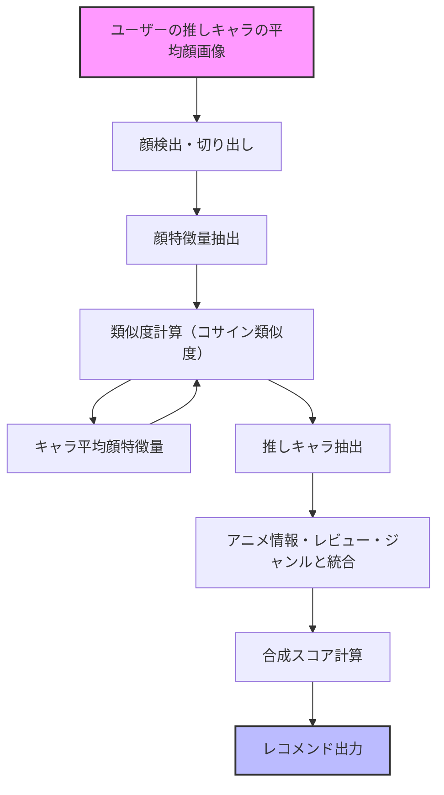

# システム全体フロー図（Mermaid）

```mermaid
graph TD;
  A["ユーザーの推しキャラの平均顔画像"] --> B["顔検出・切り出し"]
  B --> C["顔特徴量抽出"]
  C --> D["類似度計算（コサイン類似度）"]
  D --> E["キャラ平均顔特徴量"]
  E --> D
  D --> F["推しキャラ抽出"]
  F --> G["アニメ情報・レビュー・ジャンルと統合"]
  G --> H["合成スコア計算"]
  H --> I["レコメンド出力"]
  style A fill:#f9f,stroke:#333,stroke-width:2px;
  style I fill:#bbf,stroke:#333,stroke-width:2px;
```

---

## 説明
- ユーザーの推しキャラの平均顔画像から始まり、顔検出・特徴量抽出・類似度計算を経て“推しキャラ”を抽出
- アニメ情報・レビュー・ジャンルと統合し、合成スコアを計算
- 最終的にレコメンド出力として提示

Mermaid対応のMarkdownビューアやGitHub、LT用スライドツールで図として表示できます。 